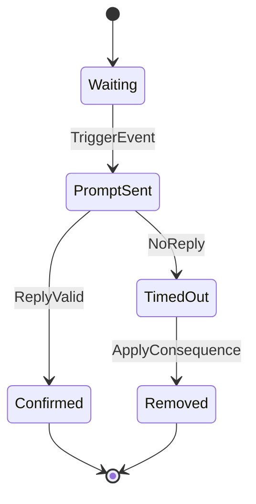

# DM Notification Agent

## Overview

The DM Notification Agent serves as the "air-traffic controller" for all player-specific, time-sensitive communications. It's a self-contained module designed to handle notification delivery, state tracking, timeout management, and fallback mechanisms when DMs fail.

## Key Features

### Tiered Notification System

Notifications are organized into three priority tiers:

1. **Tier 0 (Critical)** - Time-sensitive notifications that require immediate attention:
   - Match queue keep-alive checks
   - Pre-game ready checks
   - Always delivered regardless of user status

2. **Tier 1 (Important)** - Significant but not time-critical notifications:
   - Role retention checks
   - Match results
   - Delivered unless user has DND status

3. **Tier 2 (Informational)** - Non-urgent informational messages:
   - Server announcements
   - Game tips
   - Only delivered to active users

### State Machine Architecture

Each notification operates as an independent state machine:



### Inter-Agent Coordination

The Notification Agent coordinates with other system components:

- **Player State Agent** - Checks user status (online, AFK, DND) before sending non-critical notifications
- **Queue Manager** - Receives keep-alive triggers and reports confirmation status
- **Match Orchestration** - Handles pre-game ready checks and player confirmations

## Configuration

The agent is configured via YAML:

```yaml
dm_notification:
  # Enable/disable the plugin
  enabled: true
  
  # Notification triggers with priority tiers
  triggers:
    match_queue:
      enabled: true
      tier: 0
    pre_game:
      enabled: true
      tier: 0
    role_retention:
      enabled: false
      tier: 1
    # ... additional notification types
  
  # Timeouts (in seconds)
  timeout_seconds:
    match_queue: 120
    pre_game: 60
    role_retention: 604800
    # ... additional timeouts
  
  # Message templates
  dm_templates:
    match_queue: "🔔 You're queued for {match_name}. Reply `!ready` within {timeout} seconds to stay in queue."
    # ... additional templates
  
  # Fallback channels for different tiers
  fallback_channel_id: "1234567890"
  fallback_channel_tier0_id: "1234567890"
  fallback_channel_tier1_id: "1234567891"
  fallback_channel_tier2_id: "1234567892"
  
  # Audit logging
  log_channel_id: "0987654321"
  audit_log: true
```

## Integration API

Other plugins can interact with the DM Notification Agent through its public API:

```ruby
# Get the notification agent
dm_notification = plugin_manager.get_plugin("DMNotification")

# Critical notifications (Tier 0)
dm_notification.queue_keep_alive(user, match_name, queue_id)
dm_notification.pre_game_ready_check(user, match_id, match_details)

# Important notifications (Tier 1)
dm_notification.role_retention_check(user, role_name)
dm_notification.match_result_notification(user, match_id, score, rating_change)

# Informational notifications (Tier 2)
dm_notification.send_announcement(user, message)
dm_notification.send_tip(user, message)

# Custom notifications
dm_notification.send_custom_notification(user, type, context)

# State management
dm_notification.has_pending_notifications?(user_id)
dm_notification.pending_notification_count(user_id)
dm_notification.clear_notifications(user_id, type = nil)
```

## Audit Logging

All notification events are logged to a designated channel with the following details:

- Event type (sent, confirmed, expired, failed)
- User ID and mention
- Notification type and tier
- Timestamp and response latency
- Fallback status

## Future-Proofing

The notification agent is designed to be extensible:

1. **New Notification Types** - Add to the configuration YAML without code changes
2. **Enhanced Prioritization** - Fine-tune delivery based on user preferences and context
3. **Integration with External Systems** - API endpoints for external services to trigger notifications
4. **Analytics** - Track response rates and optimize notification timing

## Command Reference

### Player Commands

- `!ready` - Confirm readiness for queue or match
- `!active` - Confirm activity for role retention

### Admin Commands

- `!togglekeepalive [on|off]` - Enable/disable the notification system
- `!keepalive list` - List active notifications
- `!keepalive clear @user` - Clear notifications for a user
- `!keepalive triggers` - Show status of notification triggers
- `!keepalive settrigger <type> on|off` - Toggle specific notification types
